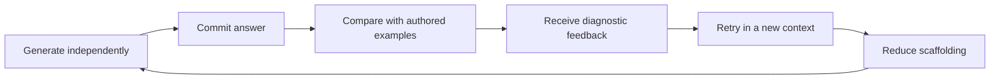

# Casework Product Upgrade: Plan for Creating the Implementation Plan

## Purpose

Turn the full playtest and product audit into an evidence-backed implementation
plan without prematurely changing the product. The final implementation plan
must preserve what already works, resolve the transfer-to-real-interviews gap,
and separate foundational learning mechanics from later content expansion.

## Recommended Direction

Plan the next release around one product promise:

> Casework makes learners generate their own reasoning, diagnoses where that
> reasoning breaks down, and gives them a targeted next repetition with less
> scaffolding over time.

The first implementation wave should improve learning mechanics and feedback.
It should not begin by expanding from 6 cases to 15–20 cases or by adding large
amounts of educational text.

The planning priority is:

1. Generate before reveal.
2. Add case opening and clarification as a trained skill.
3. Make hypothesis formation and updating explicit.
4. Diagnose reasoning errors and turn Progress into coaching.
5. Reduce scaffolding through clear practice modes.
6. Expand skills and case breadth only after those foundations work.

## Phase 1: Verify the Current Product

Before writing tasks, inspect the shipped system and produce a current-state
matrix covering:

- Every drill interaction and where it uses recognition versus generation.
- Every Learn lesson and the delay between instruction and active practice.
- All six hidden case definitions, calculations, branches, efficient paths,
  decoys, scoring rules, and feedback codes.
- Whether current full cases support multiple defensible routes in practice,
  not only in the data model.
- How clarification, framework submission, investigation, exhibits, math,
  synthesis, recommendation, replay, and recovery currently behave.
- What Progress stores, aggregates, diagnoses, and recommends.
- What is persisted for guests and signed-in learners, including compatibility
  constraints for existing Supabase data.
- Current accessibility, responsive, browser, unit, type, lint, and build
  quality gates.

Deliverable: a concise gap matrix with `keep`, `adapt`, `replace`, and `add`
labels. This closes the audit's explicit uncertainty about hidden case bodies.

## Phase 2: Resolve Product Decisions

The implementation plan must record explicit answers to these questions:

1. Does the next release remain fully deterministic and no-AI?
2. For generated answers, what is automatically scored, self-assessed, or
   compared against examples?
3. Which generated inputs stay private scratch work versus become durable
   practice evidence?
4. Are the next modes Beginner, Intermediate, and Interview, or a smaller first
   version of that progression?
5. Does Case Opening & Clarification become skill six immediately?
6. Are hypothesis thinking, brainstorming, and market sizing separate skills,
   embedded behaviors, or staged additions?
7. Which existing cases become the pilot teaching, intermediate, and interview
   experiences?
8. What existing user progress must remain comparable after scoring changes?

Recommended default: keep the next release deterministic. Let learners produce
before seeing answers, then use authored comparisons, structured self-checks,
diagnostic selections, and retry behavior. Revisit AI-assisted qualitative
coaching only after the non-AI learning loop has been validated.

Deliverable: a short decision ledger that becomes binding input to the
implementation plan.

## Phase 3: Specify the Learning Experience

Define a reusable interaction contract:

Specify how this contract appears in:

- Learn modules.
- Each drill family.
- Case opening and clarification.
- Framework creation and prioritization.
- Hypothesis statements and updates.
- Exhibit interpretation and calculations.
- Mid-case synthesis.
- Final recommendation and spoken practice.
- Progress diagnosis and next-rep recommendations.

Also define the diagnostic taxonomy before designing scores. At minimum it
should distinguish structural, prioritization, math, exhibit, synthesis, and
recommendation failure modes. Clarification, hypothesis updating,
brainstorming, communication, and market-sizing diagnostics should be added
when those behaviors enter scope.

Deliverable: learner flows, feedback rules, difficulty/scaffolding rules, and
acceptance examples for strong, defensible, weak, and low-information-value
responses.

## Phase 4: Design the Technical Change

Map the approved experience onto the current architecture:

- Versioned schemas for drills, lessons, cases, events, diagnostics, and modes.
- Deterministic engines for reveal rules, scoring, authored comparisons, and
  retry selection.
- Event additions for generated commitment, hypothesis updates, mid-case
  synthesis, self-assessment, and spoken-practice completion.
- Progress aggregation that identifies recurring error patterns rather than
  only recent scores.
- Backward-compatible persistence and any required Supabase migration.
- Server projections that continue hiding answers and future case information.
- Reusable components rather than one-off implementations per skill.
- Accessibility, keyboard, responsive, error, recovery, and privacy behavior.
- Content validation rules that prevent fake variety and duplicated reasoning
  paths.

Deliverable: a technical design and migration strategy with identified risks.

## Phase 5: Build the Roadmap Before the Task List

The final implementation plan should use three product waves.

### Wave 1: Learning and diagnosis foundation

- Generate-before-reveal interaction system.
- Case Opening & Clarification.
- Explicit hypothesis formation and updating.
- Diagnostic feedback codes and coaching-oriented Progress.
- Initial scaffolding progression.
- Upgrade a small number of representative lessons, drills, and cases as
  vertical slices before converting everything.

### Wave 2: Broader interview behaviors

- Structured brainstorming.
- Market-sizing training.
- Mid-case synthesis.
- Spoken recommendations and self-review.
- Timed/interview mode.
- More ambiguous prompts, harder exhibits, and tougher mental math.
- Conversion of remaining existing content to the new learning loop.

### Wave 3: Breadth, transfer, and repetition

- Expand toward 15–20 genuinely distinct cases.
- Add M&A/investment, product launch, dedicated market sizing, competitive
  response, and public-sector/nonprofit coverage.
- Add business-logic variants, spaced review, mixed drills, automatic weak-skill
  revisits, and advanced low-scaffolding cases.

Each wave must have an explicit user outcome, release boundary, migration plan,
and evidence that it improved interview-transfer behavior.

## Phase 6: Convert the Roadmap into an Executable Implementation Plan

For every engineering task, the implementation plan must include:

- User-visible outcome.
- Files or modules expected to change.
- Schema/content contract changes.
- Red-green-refactor test sequence.
- Unit, component, browser, accessibility, and migration checks as applicable.
- Backward-compatibility and data-safety requirements.
- Dependencies and safe commit boundary.
- Exact completion evidence.
- Context/ledger update requirements for future chats.

Tasks should be small enough to review independently and ordered so reusable
contracts and engines are established before mass content conversion.

## Phase 7: Challenge and Approve the Final Plan

Before implementation begins, review the plan against these failure modes:

- Adding content before fixing the learning loop.
- Replacing recognition with ungradable free text and calling it solved.
- Treating one authored route as the only correct case path.
- Creating scores that do not explain the learner's error.
- Breaking existing saved progress without a migration strategy.
- Adding long lessons instead of difficult repetitions.
- Building all 15–20 cases before validating two or three upgraded cases.
- Claiming interview realism while still exposing the structure in prompts.
- Making accessibility, recovery, responsive behavior, or answer secrecy worse.

Deliverable: an approved implementation plan, release estimate, risk register,
and exact first task. Product implementation starts only after this approval.

## Success Criteria for the Planning Work

The planning process is complete when:

- Every audit recommendation is accepted, deferred, or rejected with a reason.
- The next release has one clear scope and does not accidentally include all
  three waves.
- The deterministic/no-AI and generated-answer strategy is explicit.
- Existing content and hidden case logic have been technically audited.
- The diagnostic taxonomy and scaffolding progression are specified.
- Existing data and deployed-user compatibility are protected.
- The implementation plan contains testable tasks with clean dependencies.
- The first vertical slice can prove learning mechanics before broad rollout.

## Proposed Immediate Next Action

Perform Phase 1 and produce the current-state gap matrix. Then review the eight
Phase 2 product decisions with the owner before drafting the implementation
plan.
